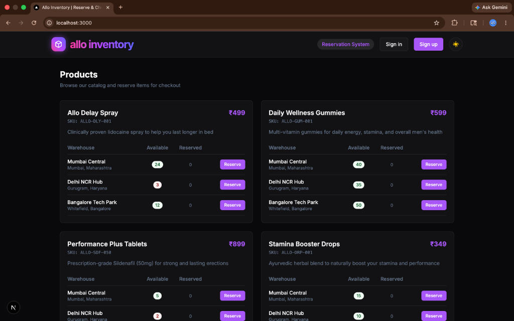
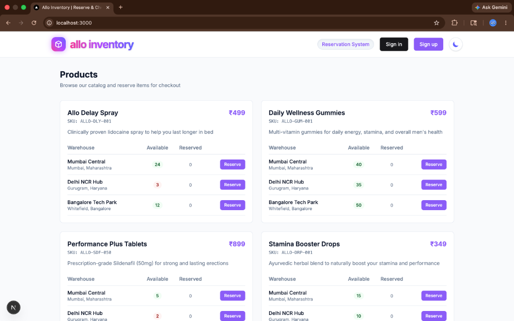
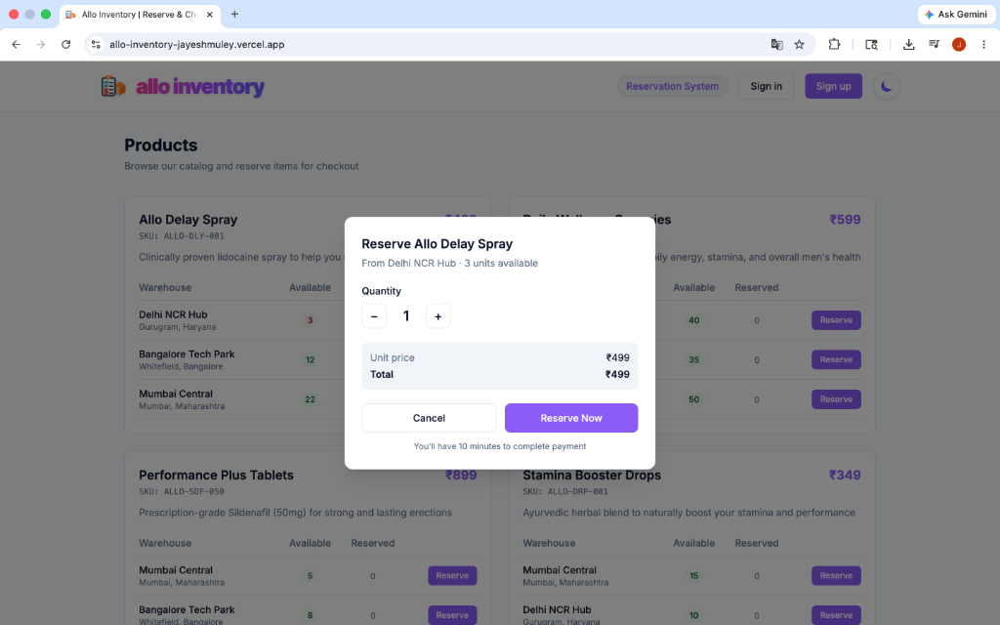
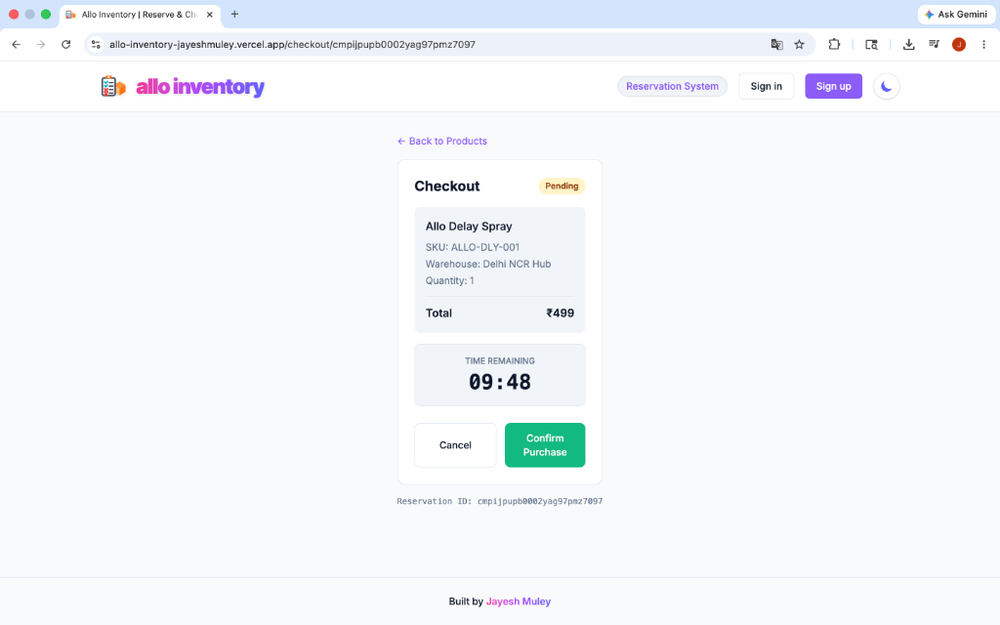
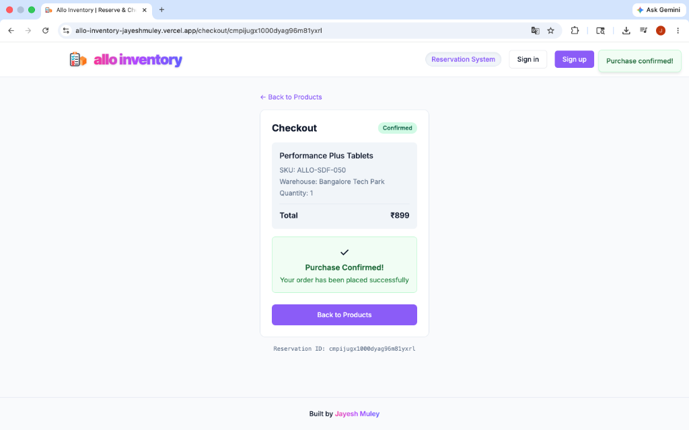
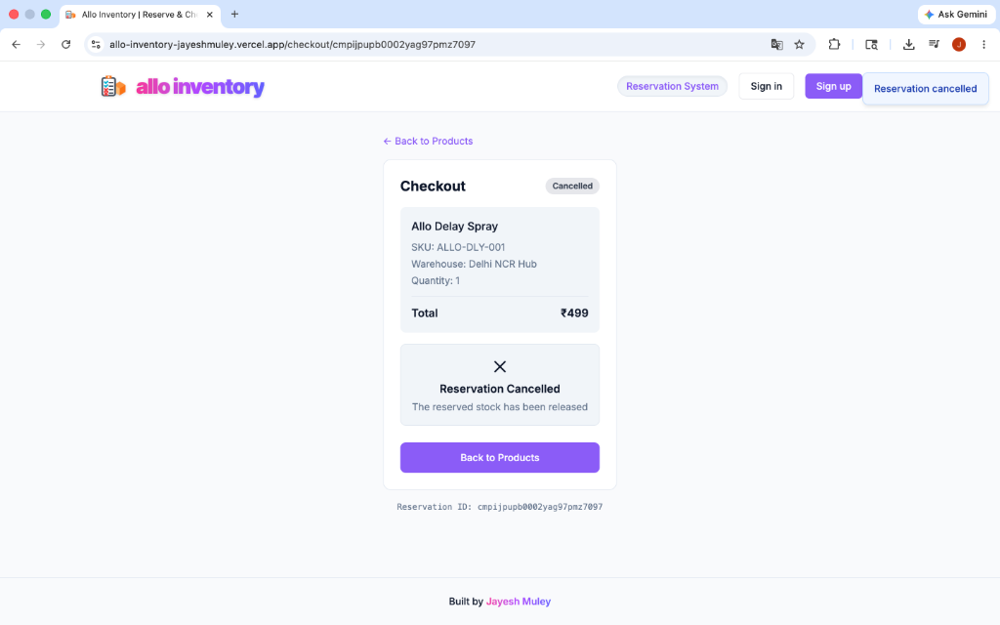
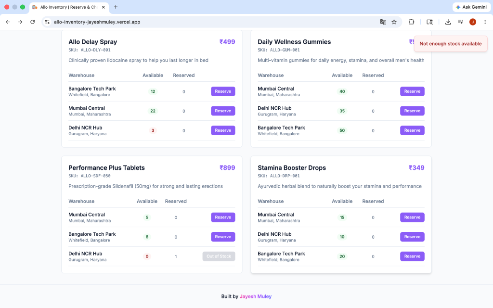
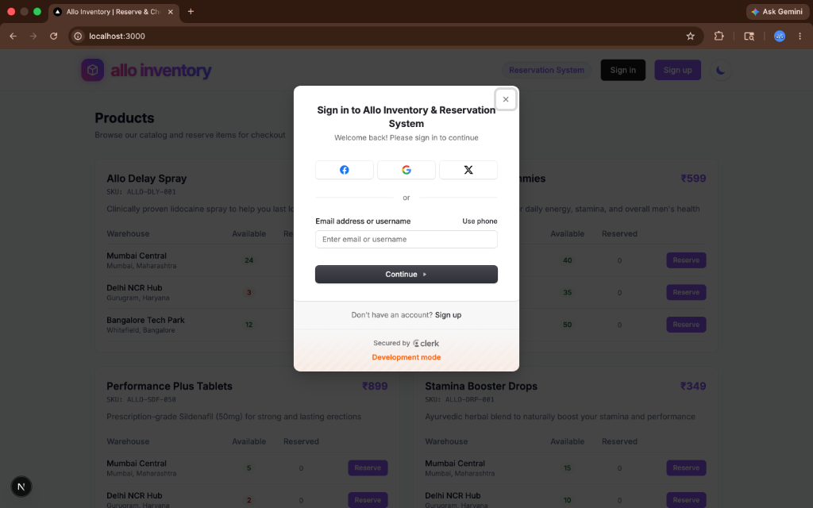
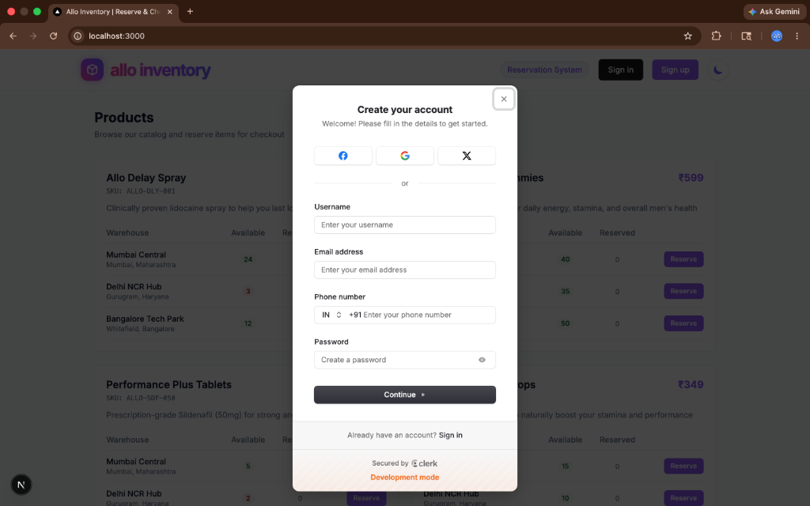
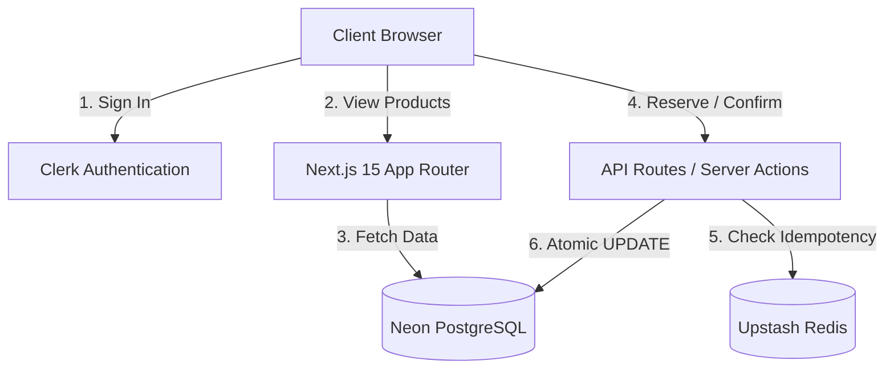

# Allo Inventory Reservation System

A multi-warehouse inventory reservation platform built with Next.js, demonstrating race-condition-free stock management. When a customer proceeds to checkout, we temporarily hold (reserve) their units for 10 minutes. If payment succeeds, the reservation is confirmed and stock is permanently decremented. If it fails or times out, the hold is released.

## Live Demo

> **[Deployed URL]** — _Add your Vercel URL here after deploying_

## Screenshots

### Product Listing (Dark Mode & Light Mode)



### Reservation Flow





### Error Handling & Edge Cases


### Authentication



## Tech Stack

- **Framework**: Next.js 16 (App Router)
- **Language**: TypeScript
- **Database**: PostgreSQL via Neon (serverless)
- **ORM**: Prisma 5
- **Cache/Idempotency**: Upstash Redis
- **Validation**: Zod
- **Styling**: Tailwind CSS v4 + custom CSS variables
- **Deployment**: Vercel

## Getting Started

### Prerequisites

- Node.js 18+
- A Neon PostgreSQL database ([neon.tech](https://neon.tech))
- An Upstash Redis database ([upstash.com](https://upstash.com))

### Setup

1. Clone the repo and install dependencies:

```bash
git clone https://github.com/jayesh3103/allo-inventory.git
cd allo-inventory
npm install
```

2. Copy the env template and fill in your credentials:

```bash
cp .env.example .env
```

You'll need:
- `DATABASE_URL` — Neon pooled connection string
- `DIRECT_URL` — Neon direct connection string (used by Prisma migrations)
- `UPSTASH_REDIS_REST_URL` — from your Upstash dashboard
- `UPSTASH_REDIS_REST_TOKEN` — from your Upstash dashboard
- `CRON_SECRET` — any random string, used to protect the cron endpoint
- `RESERVATION_TTL_MINUTES` — defaults to 10

3. Run migrations and seed the database:

```bash
npx prisma migrate dev
npx prisma db seed
```

4. Start the dev server:

```bash
npm run dev
```

Open [http://localhost:3000](http://localhost:3000).

## Testing Edge Cases (For Reviewers)

To easily verify that the core requirements (concurrency safety and expiration) are handled correctly, you can manually trigger these edge cases on the live URL.

### 1. Testing the 409 Error (Not Enough Stock / Race Condition)
Since the frontend UI limits the quantity dropdown based on available stock, you must simulate a race condition to trigger a 409 error:

1. Log into the app on **Browser Window 1**.
2. Open an **Incognito Window** (Browser Window 2) and log in with a different account.
3. In both windows, navigate to a product that only has **1 item left in stock**.
4. In Window 1, click **Reserve** and go to the checkout page. (This safely locks the last item in the database).
5. In Window 2, you are still on the product page and the UI still thinks there is 1 item left because you haven't refreshed. Click **Reserve**.
6. **Result:** The backend will block the transaction, return a `409 Conflict`, and the UI will catch it and display a red toast error saying **"Not enough stock available"** instead of failing silently.

### 2. Testing the 410 Error (Reservation Expired)
This tests the lazy-cleanup fallback and expiration logic when a user "squats" on a checkout page for too long.

1. Reserve any item normally to reach the `/checkout/...` page.
2. Notice the 10:00 countdown timer.
3. **Wait exactly 10 minutes** (go grab a coffee!).
4. Once the timer hits 00:00, the database considers the reservation dead and releases the stock back to the public.
5. Now, click the **Confirm Purchase** button.
6. **Result:** The backend will realize the reservation is expired, return a `410 Gone`, and the UI will catch it, pop up a red error saying **"Reservation has expired"**, and automatically redirect you back to the products page so you have to start over.

*(Tip: To test this faster locally, change `RESERVATION_TTL_MINUTES="1"` in your `.env`, restart the server, and wait just 1 minute.)*

## Architecture

### System Architecture Diagram



### Data Model

```text
Product ─┐
         ├──> Inventory (per product per warehouse)
Warehouse┘         │
                   │ totalUnits, reservedUnits
                   │ availableUnits = totalUnits - reservedUnits
                   │
              Reservation
              (status: PENDING | CONFIRMED | RELEASED | EXPIRED)
              (expiresAt: DateTime)
```

- **Product**: name, SKU, description, price
- **Warehouse**: name, location
- **Inventory**: links a product to a warehouse with `totalUnits` and `reservedUnits`. The composite unique constraint on `(productId, warehouseId)` ensures one row per combo.
- **Reservation**: a hold on N units of a product at a specific warehouse, with a status lifecycle and TTL.

### API Endpoints

| Method | Path | Behavior |
|--------|------|----------|
| GET | `/api/products` | List products with available stock per warehouse |
| GET | `/api/warehouses` | List warehouses |
| POST | `/api/reservations` | Reserve units (409 if insufficient stock) |
| GET | `/api/reservations/:id` | Get reservation details |
| POST | `/api/reservations/:id/confirm` | Confirm reservation (410 if expired) |
| POST | `/api/reservations/:id/release` | Release reservation early |
| GET | `/api/cron/expire-reservations` | Cron job to expire stale reservations |

### Concurrency Strategy

This is the core of the exercise. The reservation endpoint uses a **single atomic SQL UPDATE** inside a Prisma interactive transaction:

```sql
UPDATE "Inventory"
SET "reservedUnits" = "reservedUnits" + $quantity
WHERE "productId" = $productId
  AND "warehouseId" = $warehouseId
  AND ("totalUnits" - "reservedUnits") >= $quantity
```

**Why this works:**
- PostgreSQL executes this as a single atomic operation. The `WHERE` clause acts as both the check and the guard — if two concurrent requests arrive for the last unit, only one UPDATE will match the condition and return `rowCount = 1`. The other gets `rowCount = 0` and we return 409.
- There's no read-then-write gap. No optimistic locking. No application-level locks. The database handles it.
- The UPDATE and the subsequent `INSERT INTO Reservation` happen in the same Prisma `$transaction`, so they're all-or-nothing.

**Why not optimistic locking?** Optimistic locking (read version, write with version check) requires a retry loop and can fail under high contention. The atomic UPDATE approach is simpler and never needs retries — it's inherently safe.

### Reservation Expiry

I use a **hybrid approach** for reliability:

1. **Vercel Cron Job** (primary): `/api/cron/expire-reservations` runs every minute via `vercel.json` cron config. It finds all PENDING reservations past their `expiresAt` and releases the reserved units.

2. **Lazy cleanup on read** (secondary): When `GET /api/products` is called, we first expire any stale reservations before returning stock counts. This ensures the product listing always shows accurate availability, even if the cron is delayed.

3. **Lazy cleanup on reservation fetch**: When `GET /api/reservations/:id` is called for a PENDING reservation that's past its expiry, we mark it as EXPIRED inline.

In production on Vercel's free tier, cron jobs run at most every minute. The lazy cleanup ensures no stale data leaks through even if there's a delay.

### Idempotency (Bonus)

Both `POST /api/reservations` and `POST /api/reservations/:id/confirm` support the `Idempotency-Key` header.

**How it works:**
1. Client sends `Idempotency-Key: <uuid>` with the request
2. Before processing, the server checks Redis for `idempotency:<key>`
3. If found → return the cached response (same status code + body)
4. If not found → process the request, then store `{ statusCode, body }` in Redis with a 24-hour TTL

This prevents double-reservations from network retries or duplicate clicks. The frontend automatically generates a unique key per action using `crypto.randomUUID()`.

**Design choice:** I store idempotency keys in Redis rather than Postgres because:
- They're ephemeral (24h TTL) and don't need durability
- Redis lookups are faster than DB queries
- If Redis is down, we gracefully skip idempotency rather than blocking the request

## Trade-offs & What I'd Do With More Time

### Things I simplified

- **Single-item reservations**: Each reservation is for one product at one warehouse. A real checkout would support a cart with multiple items, potentially spanning warehouses.
- **No WebSocket/SSE for real-time updates**: Stock counts are fetched on page load and after actions. In production, I'd push stock updates via WebSocket so all viewers see changes instantly.
- **Basic UI**: The frontend is functional and clean but not production-polished. I focused effort on the backend correctness.

### What I'd add with more time

- **Distributed locking with Redis**: For the confirm/release endpoints, I'd add a Redis lock (SETNX with TTL) to prevent the rare case where two confirm requests for the same reservation arrive simultaneously. Currently the DB transaction handles this, but a distributed lock would add defense in depth.
- **Rate limiting**: To prevent abuse of the reservation endpoint.
- **Monitoring & alerting**: Track reservation creation rate, expiry rate, 409 rate.
- **Database connection pooling**: Neon handles this at the infra level, but for a self-hosted Postgres I'd add PgBouncer.
- **Integration tests**: A concurrency test that fires 10+ parallel requests for limited stock and verifies exactly N succeed.
- **Proper error boundaries**: React error boundaries for graceful failure handling.

## Project Structure

```
src/
├── app/
│   ├── api/
│   │   ├── products/route.ts          # GET /api/products
│   │   ├── warehouses/route.ts        # GET /api/warehouses
│   │   ├── reservations/
│   │   │   ├── route.ts               # POST /api/reservations
│   │   │   └── [id]/
│   │   │       ├── route.ts           # GET /api/reservations/:id
│   │   │       ├── confirm/route.ts   # POST confirm
│   │   │       └── release/route.ts   # POST release
│   │   └── cron/
│   │       └── expire-reservations/route.ts
│   ├── checkout/[id]/page.tsx         # Checkout page
│   ├── layout.tsx                     # Root layout
│   ├── page.tsx                       # Product listing
│   └── globals.css                    # Global styles
├── components/
│   ├── countdown-timer.tsx            # Live countdown
│   ├── product-card.tsx               # Product display
│   ├── reserve-dialog.tsx             # Reservation modal
│   ├── reservation-status.tsx         # Status badge
│   └── toast.tsx                      # Toast notifications
└── lib/
    ├── prisma.ts                      # Prisma client singleton
    ├── redis.ts                       # Upstash Redis client
    ├── validators.ts                  # Zod schemas
    ├── idempotency.ts                 # Idempotency via Redis
    └── reservation-expiry.ts          # Shared expiry logic

prisma/
├── schema.prisma                      # Data model
├── seed.ts                            # Seed script
└── migrations/                        # Migration history
```
